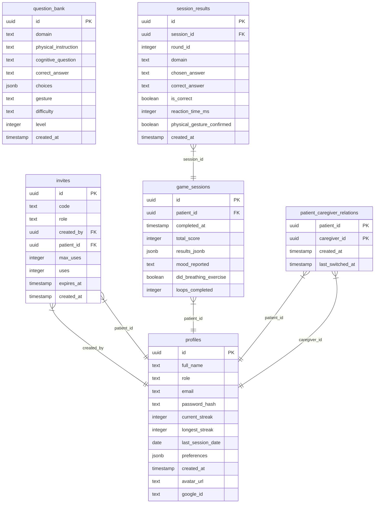

# Database Schema

**Generated At:** Mon, 14 Sep 2026 13:08:54 GMT

## ER Diagram

## Tables

### `question_bank`

| Column | Type | Nullable | Default | Constraints |
|---|---|---|---|---|
| `id` | `uuid` | false | `gen_random_uuid()` | Primary Key |
| `domain` | `text` | false | `` |  |
| `physical_instruction` | `text` | false | `` |  |
| `cognitive_question` | `text` | false | `` |  |
| `correct_answer` | `text` | false | `` |  |
| `choices` | `jsonb` | false | `` |  |
| `gesture` | `text` | false | `` |  |
| `difficulty` | `text` | false | `` |  |
| `level` | `integer` | true | `1` |  |
| `created_at` | `timestamp with time zone` | false | `now()` |  |

### `invites`

| Column | Type | Nullable | Default | Constraints |
|---|---|---|---|---|
| `id` | `uuid` | false | `gen_random_uuid()` | Primary Key |
| `code` | `text` | false | `` |  |
| `role` | `text` | false | `` |  |
| `created_by` | `uuid` | true | `` | FK -> profiles.id |
| `patient_id` | `uuid` | true | `` | FK -> profiles.id |
| `max_uses` | `integer` | false | `1` |  |
| `uses` | `integer` | false | `` |  |
| `expires_at` | `timestamp with time zone` | true | `` |  |
| `created_at` | `timestamp with time zone` | false | `now()` |  |

### `game_sessions`

| Column | Type | Nullable | Default | Constraints |
|---|---|---|---|---|
| `id` | `uuid` | false | `gen_random_uuid()` | Primary Key |
| `patient_id` | `uuid` | false | `` | FK -> profiles.id |
| `completed_at` | `timestamp with time zone` | false | `now()` |  |
| `total_score` | `integer` | true | `` |  |
| `results_jsonb` | `jsonb` | true | `` |  |
| `mood_reported` | `text` | true | `` |  |
| `did_breathing_exercise` | `boolean` | true | `` |  |
| `loops_completed` | `integer` | true | `1` |  |

### `profiles`

| Column | Type | Nullable | Default | Constraints |
|---|---|---|---|---|
| `id` | `uuid` | false | `gen_random_uuid()` | Primary Key |
| `full_name` | `text` | false | `` |  |
| `role` | `text` | false | `` |  |
| `email` | `text` | true | `` |  |
| `password_hash` | `text` | true | `` |  |
| `current_streak` | `integer` | true | `` |  |
| `longest_streak` | `integer` | true | `` |  |
| `last_session_date` | `date` | true | `` |  |
| `preferences` | `jsonb` | true | `` |  |
| `created_at` | `timestamp with time zone` | false | `now()` |  |
| `avatar_url` | `text` | true | `` |  |
| `google_id` | `text` | true | `` |  |

### `session_results`

| Column | Type | Nullable | Default | Constraints |
|---|---|---|---|---|
| `id` | `uuid` | false | `gen_random_uuid()` | Primary Key |
| `session_id` | `uuid` | false | `` | FK -> game_sessions.id |
| `round_id` | `integer` | false | `` |  |
| `domain` | `text` | false | `` |  |
| `chosen_answer` | `text` | false | `` |  |
| `correct_answer` | `text` | false | `` |  |
| `is_correct` | `boolean` | false | `` |  |
| `reaction_time_ms` | `integer` | false | `` |  |
| `physical_gesture_confirmed` | `boolean` | false | `` |  |
| `created_at` | `timestamp with time zone` | false | `now()` |  |

### `patient_caregiver_relations`

| Column | Type | Nullable | Default | Constraints |
|---|---|---|---|---|
| `patient_id` | `uuid` | false | `` | Primary Key, FK -> profiles.id |
| `caregiver_id` | `uuid` | false | `` | Primary Key, FK -> profiles.id |
| `created_at` | `timestamp with time zone` | false | `now()` |  |
| `last_switched_at` | `timestamp with time zone` | false | `now()` |  |

